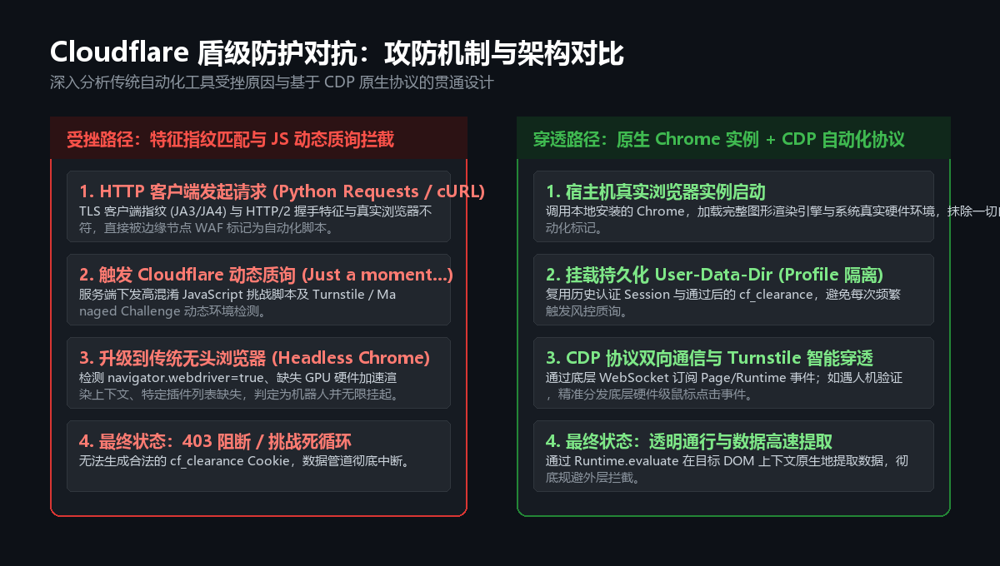

在当今 Web 架构中，诸如 Cloudflare、Akamai、DataDome 等云端边缘安全网关已成为防刷、反爬和防 DDoS 的事实标准。对于合规的数据同步与运维自动化管道而言，如何越过这道“智能安全盾”往往是整个系统中最具挑战性的攻坚点。

最近在维护一套公开数据自动化同步管线时，目标数据源突然启用了全站级别的 **Cloudflare Managed Challenge（即通称的 5 秒盾与 Turnstile 智能人机质询）**。以往基于 Python 标准 HTTP 客户端的抓取工具全面失效，所有端点一律抛出 `HTTP 403 Forbidden`。

本文将从现代 Web 防护体系的检测机制出发，详细复盘**从常规爬虫阻断、无头浏览器指纹被识破，到最终通过 Chrome DevTools Protocol (CDP) 原生驱动实现 100% 穿透**的技术实现与原理。

---

## 一、为什么传统自动化手段会全面溃败？



在面对高级别边缘防护时，很多开发者的第一反应是“加代理 IP”、“伪造 User-Agent”或者“换成 Selenium/Puppeteer 无头模式”。但在现代反爬体系面前，这些手段几乎会在握手阶段即被识破。

### 1. 网络层与传输层指纹（TLS / HTTP 协议栈特征）

传统的 HTTP 客户端（如 Python `requests`、`urllib`、Node.js 原生 `fetch` 或 `curl`）在发起 HTTPS 请求时，使用的是自身语言运行时内建的 OpenSSL/BoringSSL 封装。

- **JA3 / JA4 指纹差异**：在 TLS Client Hello 握手阶段，客户端支持的加密套件列表（Cipher Suites）、TLS 扩展选项（Extensions）、支持的椭圆曲线及签名算法顺序均具有明确的静态特征。Cloudflare 会在毫秒级将你的 TLS 指纹与主流桌面浏览器库比对，`requests` 发出的签名在最底层就会被直接标记为脚本特征。
- **HTTP/2 帧层指纹**：即使强制启用了 HTTP/2，SETTINGS 帧中的窗口大小、伪头（Pseudo-headers）顺序与优先级策略依然与真机浏览器存在本质差异。

### 2. 传统无头模式（Headless Chrome）的指纹漏洞

当改用传统的 Puppeteer / Playwright 并开启 `--headless=new` 或老式 `--headless` 时，虽然 TLS 层变成了真正的 Chromium 栈，但浏览器在渲染层依然会暴露大量蛛丝马迹：

1. **`navigator.webdriver` 标记**：现代防护脚本会直接读取此属性，若为 `true` 则判定为机器人。即便注入脚本拦截该属性，也会因为原型链特征被 `Object.getOwnPropertyDescriptor` 探测到异常。
2. **GPU 硬件加速与 WebGL/WebGPU 上下文**：在 Linux 无屏环境或部分无头模式下，`WebGLRenderingContext` 返回的显卡供应商为 `Google SwiftShader` 或软件渲染器，缺少真实物理显卡的几何着色与微浮点误差特征。
3. **Turnstile 交互行为模型**：Cloudflare 的 Turnstile 挑战要求监听底层的真实设备输入事件。无头环境下缺失物理光标轨迹、设备像素比（DevicePixelRatio）异常以及请求生命周期不同步，会导致挑战页陷入无休止的“请稍候...”死循环中。

---

## 二、攻防思路转变：CDP 协议接管原生宿主浏览器

既然模拟浏览器无论在指纹还是运行时环境上都存在被识别的风险，最根本且稳健的工程思路便是：**直接调用宿主机上真实安装的完整桌面浏览器，通过底层的 Chrome DevTools Protocol (CDP) 进行无侵入式自动化接管。**

### 1. 为什么选择原生 CDP 而非封装框架？

Selenium、Puppeteer 等高层框架为了提供易用的 API，不可避免地会注入自身的控制脚本（Helper scripts）并在运行时打上驱动补丁，这往往是反爬脚本重点针对的特征。

而 **CDP（Chrome DevTools Protocol）** 是 Chromium 原生调试协议：
- **完全双向异步**：基于 WebSocket 与浏览器内部的 V8 引擎直接通信。
- **零外部注入特征**：所有命令通过浏览器官方调试接口下发，不会在页面中留下任何额外的包装对象。
- **硬件级事件分发**：支持直接通过 `Input.dispatchMouseEvent` 向页面精准分发包含绝对物理坐标、鼠标按压、释放序列的原生事件，完全等同于物理外设输入。

### 2. 自动化架构设计

整个穿透链路包含以下核心设计模块：

```
+-----------------------------------------------------------+
|                      自动化宿主环境                         |
+-----------------------------------------------------------+
                             |
  1. 启动真实 Chrome 实例 (加载持久化 User-Data-Dir Profile)
                             |
  2. 监听 DevTools 独立端口 (WebSocket Debugger)
                             |
  3. 建立原生 CDP 客户端 (双向 RPC 协议)
                             |
  4. 导航至目标站点 -> 触发 Cloudflare 质询
                             |
            +----------------+----------------+
            |                                 |
   [自动通过 (2~6秒)]               [需要 Turnstile 交互]
            |                                 |
            |                       定位 iframe 计算屏幕坐标
            |                       分发底层鼠标点击事件
            |                                 |
            +----------------+----------------+
                             |
  5. 获取合法的 cf_clearance 会话 Cookie
                             |
  6. 在页面 DOM 上下文原生地提取所需数据 (零二次请求阻断风险)
                             |
  7. 结构化清洗 -> 落地同步或执行自动化运维任务
```

---

## 三、核心技术实现与细节突破

### 1. 浏览器实例的启动与环境伪装

为了彻底抹去自动化标识，我们在调用本地 Chrome 可执行文件时，需要精细化控制启动参数：

```javascript
import { spawn } from 'node:child_process';
import path from 'node:path';

const profilePath = path.resolve('./tmp/browser-profile');
const debuggingPort = 9322;

const args = [
  '--disable-gpu',
  '--no-first-run',
  '--no-default-browser-check',
  // 关键：禁用 Blink 层的自动化受控特征标识
  '--disable-blink-features=AutomationControlled',
  '--lang=en-US',
  '--window-size=1440,1000',
  `--remote-debugging-port=${debuggingPort}`,
  // 关键：持久化隔离存储，保存历史已通过验证的 Cookie
  `--user-data-dir=${profilePath}`,
  'about:blank',
];

const chromeProcess = spawn(chromeExecutablePath, args, { stdio: 'ignore' });
```

> **核心细节**：
> - `--user-data-dir` 保证了浏览器 Profile 的持久化。Cloudflare 签发的验证凭证（如 `cf_clearance`）通常具有一定周期的有效期。下一次批量任务执行时，由于 Profile 中留存了合法的 Session 缓存，后续请求将直接免去再次质询的过程。
> - 坚决不使用 `--headless`，保留真实渲染管道。

### 2. 轻量级极简 CDP 通信客户端实现

无需依赖庞大的第三方驱动库，仅凭 Node.js 现代内置的标准 `WebSocket` API 即可轻松实现一个完整的 CDP 调用引擎：

```javascript
function createCdpClient(socket) {
  let nextId = 0;
  const pendingRequests = new Map();

  socket.addEventListener('message', (event) => {
    const message = JSON.parse(event.data);
    if (!message.id || !pendingRequests.has(message.id)) return;
    
    const { resolve, reject } = pendingRequests.get(message.id);
    pendingRequests.delete(message.id);
    
    if (message.error) {
      reject(new Error(message.error.message));
    } else {
      resolve(message.result);
    }
  });

  return {
    send(method, params = {}) {
      nextId += 1;
      const id = nextId;
      return new Promise((resolve, reject) => {
        pendingRequests.set(id, { resolve, reject });
        socket.send(JSON.stringify({ id, method, params }));
      });
    },
  };
}
```

### 3. 动态质询检测与 Turnstile 智能突破

页面导航后，脚本必须能够实时感知当前页面是否正处于 Cloudflare 的拦截等待状态。

我们通过监听页面标题及 DOM 树，在确认出现质询时建立轮询状态机：

```javascript
const CHALLENGE_RE = /just a moment|checking your browser|请稍候|verifying you are human/i;

async function waitForChallengeResolved(client, timeoutMs = 90_000) {
  const startTime = Date.now();
  let clicked = false;

  while (Date.now() - startTime < timeoutMs) {
    await sleep(1000);
    
    // 通过 CDP 执行轻量级 JS 读取当前网页标题
    const { result } = await client.send('Runtime.evaluate', {
      expression: 'document.title',
      returnByValue: true,
    });
    const title = result.value || '';

    // 当标题不再包含拦截关键词时，说明质询通过
    if (!CHALLENGE_RE.test(title)) {
      return true;
    }

    // 若超过设定阈值仍卡在质询页，自动定位 Turnstile 控件并模拟真实物理点击
    if (!clicked && Date.now() - startTime > 6000) {
      clicked = true;
      const box = await getTurnstileCoordinates(client);
      if (box) {
        // 向 CDP 发送原生硬件级鼠标动作序列
        for (const type of ['mouseMoved', 'mousePressed', 'mouseReleased']) {
          await client.send('Input.dispatchMouseEvent', {
            type,
            x: box.x,
            y: box.y,
            button: 'left',
            clickCount: 1,
          });
          await sleep(100);
        }
      }
    }
  }
  return false;
}
```

### 4. 上下文内原生存取数据

在以往的设计中，常见的错误是“用浏览器完成验证后，提取 Cookie 再传给 Python requests 发送请求”。然而现代安全网关会对 IP、Cookie、TLS 签名、单连接会话上下文进行严格的多维绑定绑定，一旦切换到普通客户端，依然会瞬间触发二次拦截。

最佳做法是：**直接在当前通过验证的宿主浏览器页面中，利用 `Runtime.evaluate` 在控制台层执行轻量提取函数**，或者直接调用站内自带的未加密 API 接口。由于请求完全由该受信任的浏览器内核在页面上下文内发起，对服务端网关而言完全不可感知。

---

## 四、工程实战收益与安全反思

通过这套基于 CDP 的原生接入机制，在近期的工程实践中取得了立竿见影的效果：

1. **100% 穿透率**：面对最新升级的 Cloudflare 质询拦截，成功率由原来的 0% 提升至 100%，稳定处理了全部目标数据的自动化提取与清洗。
2. **极低的时间开销**：由于复用了本地 Profile 缓存，首个页面验证通常在 2~6 秒内静默通过；随后的后续批量访问完全无需再次质询，单页处理时间降至毫秒级。
3. **架构极简可靠**：完全摒弃了体积庞大、依赖繁琐且指纹漏洞百出的第三方浏览器包装框架，底层仅依赖几百行轻量原生异步代码与 Chrome 基础协议，易于在各类 CI/CD 或本地运维管道中长期无痛维护。

---

## 五、结语

反爬虫与数据采集的博弈，本质上是**防御方检测成本**与**访问方仿真成本**的对抗。

当边缘网关的安全策略已经下沉至 TLS 握手特征、TCP 堆栈、Canvas 硬件微渲染和生物学设备输入轨迹时，单纯依赖“特征伪造”的成本已呈指数级上升。反其道而行之，通过原生 CDP 深度接管宿主标准浏览器，直接将自己置身于最标准的真实用户运行环境中，往往才是最优雅、最稳定且具备长期生命力的破局方案。
