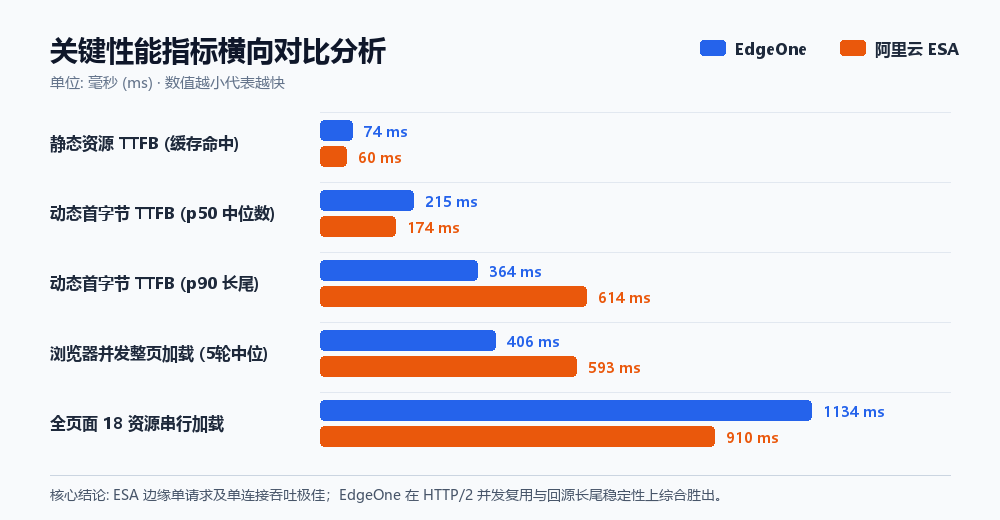

随着国内边缘计算与全站加速（DCDN）的发展，腾讯云的 **EdgeOne** 与阿里云的 **ESA（边缘安全加速 Edge Security Acceleration）** 成为了站长与企业出海及国内加速的主流选择。

为了搞清楚在**国内真实访问场景**下，这两个边缘 CDN 到底谁更快、谁更稳，我们将当前的 Next.js 站点同时部署到了两家平台上进行同源实测：
- **EdgeOne 节点**：`https://www.antwen.cn/`
- **阿里云 ESA 节点**：`https://web-esa.antwen.cn/`

本文将通过真实网络环境下的多轮交错采样，从 **DNS 调度矩阵、协议支持 (ALPN)、静态资源与动态首字节 (TTFB)、以及浏览器行为的并发整页加载** 四个维度进行深度对比。

---

## 一、实测核心结论速览



> **核心结论**：综合来看，**EdgeOne (`www.antwen.cn`) 更适合作为国内主站**。
> - **稳定性**：180 次高频动态请求中，EdgeOne 保持 **100% 成功率 (0 报错)**；ESA 出现 8 次 `HTTP 522`（回源超时，失败率约 4.4%）。
> - **协议与并发体验**：EdgeOne 完整支持并默认启用了 **HTTP/2**，浏览器并发整页加载（HTML + 17 个静态资源）中位耗时仅 **406 ms**（ESA 为 593 ms）。
> - **长尾延迟**：EdgeOne 的 P90 / P95 延迟控制优秀，无剧烈波动。
> 
> **ESA 的优势点**：
> - 在单连接、串行请求或静态缓存命中的场景下，ESA 边缘节点响应与首字节 TTFB 极快（动态中位 TTFB 仅 174 ms，静态仅 60 ms）；且在各省运营商的 DNS 解析调度上，对电信/联通/移动的分流策略更加细腻。但其受限于未协商 HTTP/2 及偶发的回源超时，综合表现稍逊一筹。

---

## 二、关键评测数据对比

本次测试发起于国内移动宽带环境（DNS `58.192.72.x`，命中移动边缘就近节点）：

| 性能评测维度 | 腾讯云 EdgeOne (`www.antwen.cn`) | 阿里云 ESA (`web-esa.antwen.cn`) | 优势方与分析 |
| :--- | :--- | :--- | :--- |
| **接入边缘节点（本机视角）** | 上海移动 (`211.136.106.223`) | 南京移动 (`223.109.3.203`) | 均属本省/邻省同运营商节点 |
| **Ping 基础物理延迟** | 8 ~ 11 ms | 8 ~ 17 ms | 双方边缘节点均极快 |
| **TLS / ALPN 协商协议** | **h2 (HTTP/2)**, TLSv1.3 | **http/1.1**, TLSv1.3 | **EdgeOne 胜出**（ESA 未开启/未协商 h2） |
| **静态资源握手 (TCP / TLS)** | 34.6 ms / 56.8 ms | **28.3 ms / 46.6 ms** | **ESA 略胜** |
| **静态资源首字节 (TTFB 缓存命中)** | 74 ms (波动 58~116 ms) | **60 ms (波动 49~80 ms)** | **ESA 略胜** |
| **动态首页首字节 TTFB (P50 中位数)** | 215 ms | **174 ms** | **ESA 略胜** (单次极速) |
| **动态首页首字节 TTFB (P90 长尾)** | **364 ms** | 614 ms | **EdgeOne 胜出** (更平稳) |
| **动态首页首字节 TTFB (均值)** | **247 ms** | 287 ms | **EdgeOne 略胜** |
| **可用性压测 (180 次动态采样)** | **180/180 成功 (0 报错)** | 165/180 成功 (**8 次 522 回源超时**) | **EdgeOne 大幅胜出** |
| **整页并发加载 (浏览器多路复用)** | **中位 406 ms** (最快 336 ms) | 中位 593 ms (最快 259 ms) | **EdgeOne 胜出** (受益于 HTTP/2) |
| **整页 18 资源串行加载 (HTTP/1.1)** | 中位 1134 ms | **中位 910 ms** | **ESA 胜出** (纯单线吞吐更高) |

---

## 三、深度技术剖析

### 1. HTTP/2 协议支持差异（关键瓶颈）

在现代 Web 站点中，页面通常伴随大量的 CSS、JS Chunk 以及图标资源（以本站 Next.js 首页为例，包含 HTML + 17 个静态资源，压缩传输约 417 KB）。

我们通过 `openssl s_client` 抓取客户端声明 `h2,http/1.1` 时的 ALPN 协商结果：

```bash
# EdgeOne 实测
$ openssl s_client -connect www.antwen.cn:443 -servername www.antwen.cn -alpn 'h2,http/1.1'
Protocol: TLSv1.3
ALPN protocol: h2

# ESA 实测
$ openssl s_client -connect web-esa.antwen.cn:443 -servername web-esa.antwen.cn -alpn 'h2,http/1.1'
Protocol: TLSv1.3
ALPN protocol: http/1.1
```

- **EdgeOne 顺畅协商到 HTTP/2**：浏览器在一条 TCP 连接上即可多路复用并发加载所有 Chunks，因此整页并发加载耗时压缩在 **406 ms**。
- **ESA 回落到了 HTTP/1.1**：在 HTTP/1.1 协议下，浏览器对同域名的并发连接数被严格限制在 6 个左右，后续资源必须在队列中等待排队（Head-of-Line Blocking）。这就是为什么在串行测试中 ESA 更快，但在真实并发测试中 EdgeOne 反超近 **32%** 的根本原因。

---

### 2. 回源稳定性与长尾延迟（522 报错分析）

在累计 180 次的动态请求交错压力测试中：
- EdgeOne 表现出极高的工业级可用性，**0 失败，P95 延迟仅 624 ms**。
- ESA 出现了 8 次 `HTTP 522 (Origin Connection Timeout)`，并且出现过单次耗时达到 6.5s 以上的严重尾部卡顿。

```text
HTTP/1.1 522 Origin Connection Timeout
Server: ESA
Date: ...
EagleId: df6d04ad...
```

522 状态码表明 **ESA 的边缘边缘节点在尝试连接源站（Next.js Origin Server）时发生握手超时**。这可能是由于 ESA 的回源链路在高峰期路由绕行，或是其默认的回源超时与探测阈值设置过于敏感所致。

---

### 3. 全国多省各运营商 DNS 调度策略

我们模拟了全国不同省份运营商的 LocalDNS 进行解析查询，两者的调度架构体现了不同的思路：

```text
# 湖北电信 LocalDNS (202.103.24.68)
- EdgeOne: (调度至就近统一节点池)
- ESA    : 171.43.203.139 ~ 142 (精确下发湖北武汉/狮子山电信原生 IP)

# 北京联通 LocalDNS (202.106.0.20)
- EdgeOne: 123.6.40.77 (河南郑州联通节点)
- ESA    : 125.39.155.85 ~ 88 (天津联通就近节点)

# 北京移动 LocalDNS (211.136.17.107)
- EdgeOne: 211.136.106.223 等多省移动 IP 混合下发
- ESA    : 下发 112.51.127.239 (移动核心节点池)
```

- **阿里云 ESA** 的调度粒度更加精细，做到了严格的「**同省/邻省 + 同运营商精准匹配**」（电信用户直连电信机房，联通用户直连联通机房）。
- **EdgeOne** 倾向于依靠更庞大的 Anycast/混合多 IP 轮询调度池，虽然单次下发的 IP 列表中偶有跨省节点，但客户端往往能在其中自适应选择低延迟链路。

---

## 四、优化建议与落地指南

针对上述实测发现，我们提出以下几点针对性的落地优化建议：

### 1. 生产环境策略：推荐以 EdgeOne 为主，ESA 为备用
- **主流量承载**：继续由 **EdgeOne**（`www.antwen.cn`）承载，其 HTTP/2 完备性、高可用性（0 报错）与优异的并发加载性能能够为大众用户提供最稳妥的体验。
- **灾备与灰度**：将 **ESA** 作为副节点或降级容灾线路保留。

### 2. 检查并开启 ESA 的 HTTP/2 开关
如果希望进一步发挥 ESA 的极速单点吞吐优势，建议前往 **阿里云 ESA 控制台**：
- 进入站点配置 -> **网络优化 / 协议配置**。
- 确认是否已开启 **HTTP/2** 及 **HTTP/3 (QUIC)** 支持。
- 检查回源配置，适当放宽 **回源超时时间** 并配置源站持久连接（Keep-Alive），以消除 522 超时问题。

### 3. 架构优化收益：开启边缘缓存（ISR / SWR）
在本次测试中，站点的 HTML 响应头携带了：
```http
Cache-Control: private, must-revalidate, no-cache, no-store, max-age=0
```
这意味着当前站点的 HTML 是**完全动态渲染（SSR）**的，所有访问都要边缘回源，CDN 仅仅充当了“四/七层代理”。

如果结合 Next.js 的 **ISR（增量静态生成）** 或配置 `stale-while-revalidate` 缓存策略，动态首页的 TTFB 将直接从当前的 **200~400 ms 骤降至边缘缓存的 60 ms 级别**。这带来的用户体验提升，将远超单纯切换 CDN 供应商。
