# GTA数据库用户使用手册

[GTA数据库网站](https://www.antwen.cn)

# 我的车库

我的车库为本站的核心主打功能，可以快速批量创建玩家自己的车库索引，实现批量筛选、数据分析等功能。

1. 在注册账号（Outlook邮箱用户邮件在垃圾邮件中）并登陆后，进入我的车库页面

   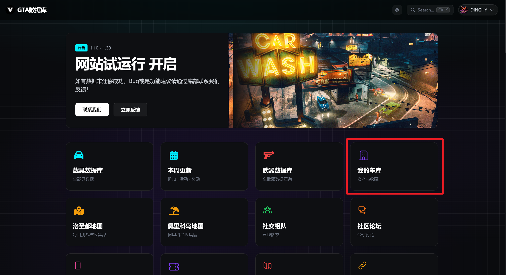

2. 进入页面后点击车库配置，找到对应的车库选择启用车库

   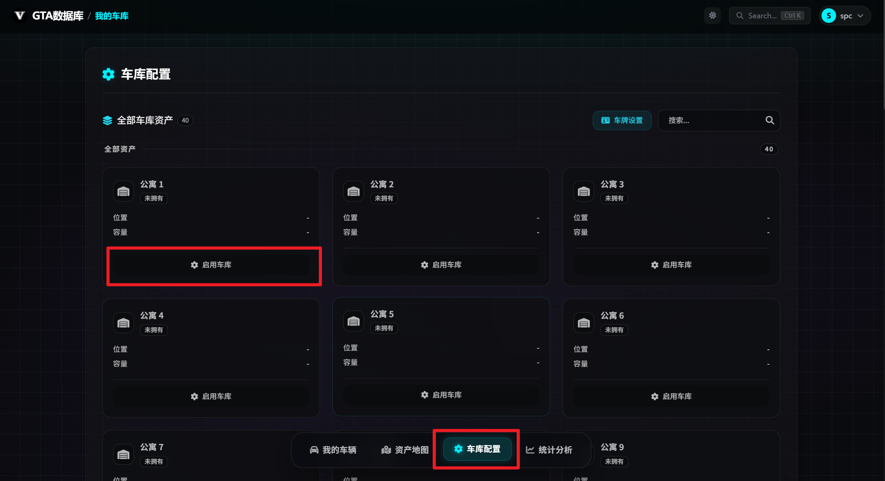

 首先点击启用此车库，然后选择位置，对于有楼层可供购买的车库，需要点击拥有多少层。如果想要在网站内保存车牌信息，点击车牌配置并添加自己的车牌。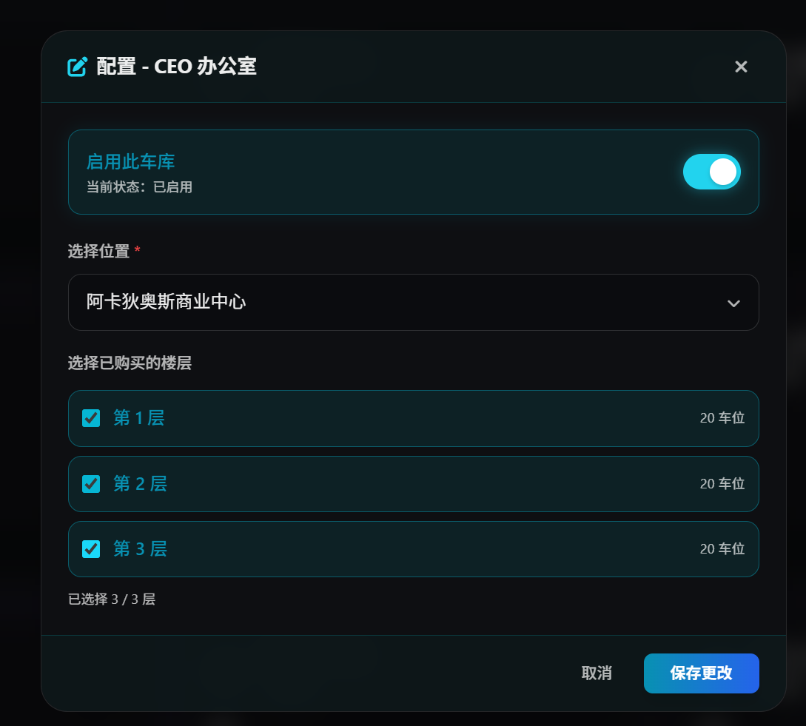

3. 回到我的车辆页面，选择对应车库，点击添加车辆/批量导入。

   添加车辆，搜索自己的车辆，进入车辆配置界面，点击已改装可以设置特殊升级、配置涂装、车牌等等。也可以设置车辆备注信息。

   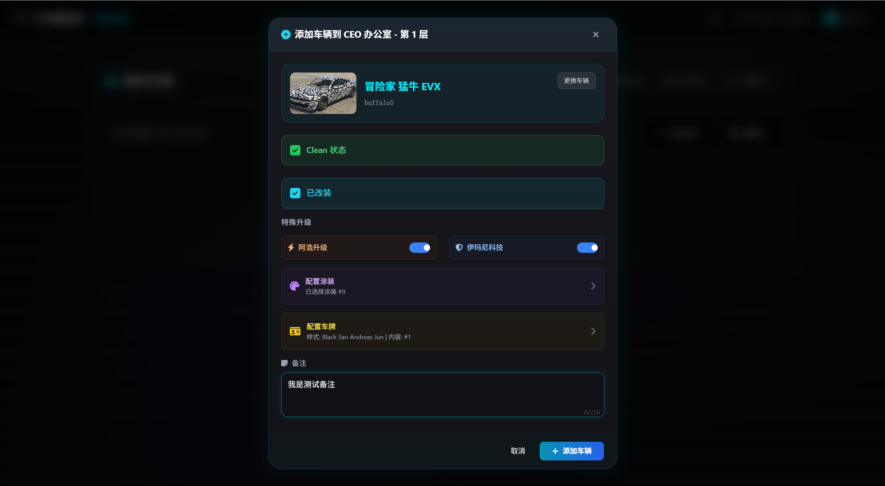

   对于车辆较多的玩家，也可以批量导入，可以识别游戏内车库截图，批量粘贴到窗口内，然后点击开始识别（识别不到的根据载具数据库里的车辆信息修改车名）。也可以点击截图识别上传车库截图到网站进行快速识别（这个精准度不是很高，可以看情况修改）。没问题后点击确认导入。

   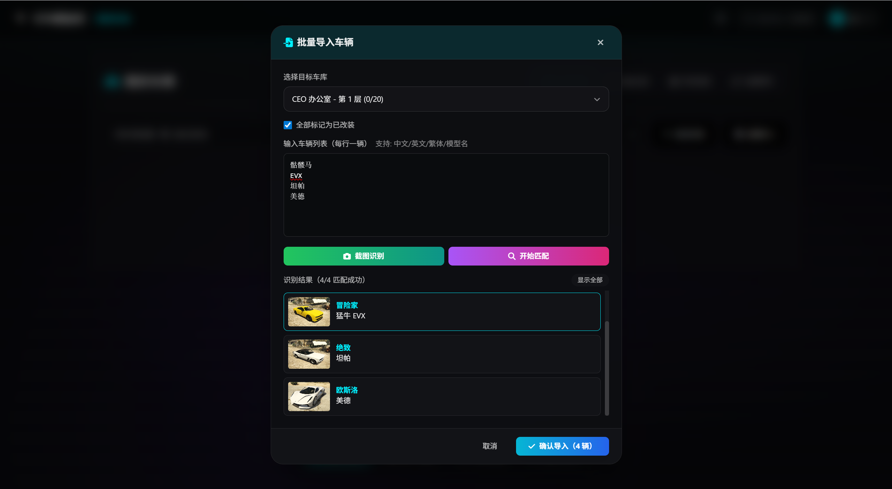

4. 数据分析、更多功能实现。

   车库/整体视图：点击车辆卡片可以编辑车辆信息，拖动车辆卡片可以调整车辆顺序

   列表视图：导出Excel表格，可以选择导出的字段。

   批量转移：两边选择车库，然后批量将车库内的车辆转移到另一个车库/批量删除/调整顺序。

   统计分析：车库总结

   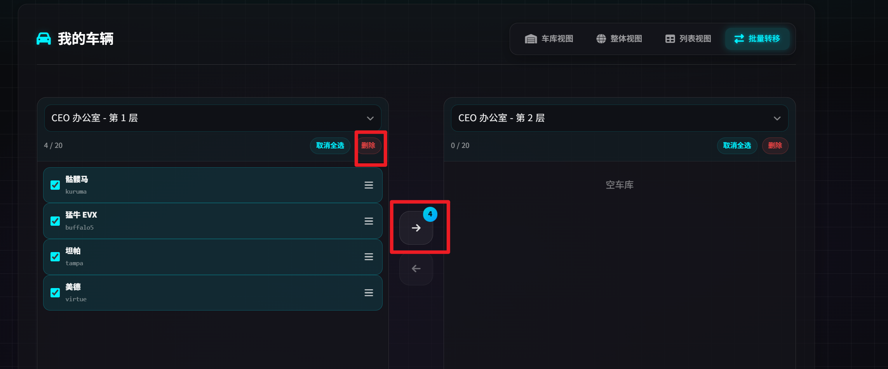

# 载具数据库

点击筛选可以根据条件进行车辆筛选（更多筛选条件点击后展开），可以进行车辆对比、自定义排序。会自动根据本周更新内容判断返场车辆信息、折扣信息等。

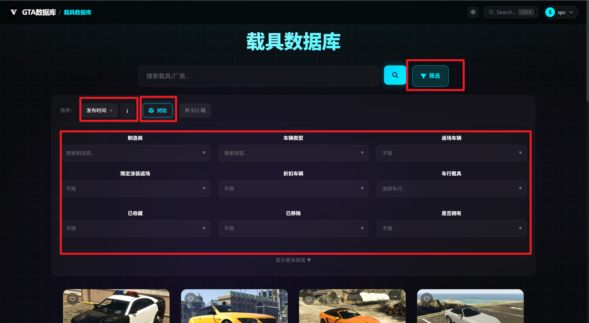

车辆收藏功能，点击车辆卡片左上方的爱心可以收藏车辆。也可以在根据收藏的车辆邮件提醒是否返场。（在后面邮件订阅部分介绍）

批发价解锁，进入车辆详情页面可以选择解锁批发价，对于已解锁/未解锁批发价车辆可以在更多筛选条件里筛选。

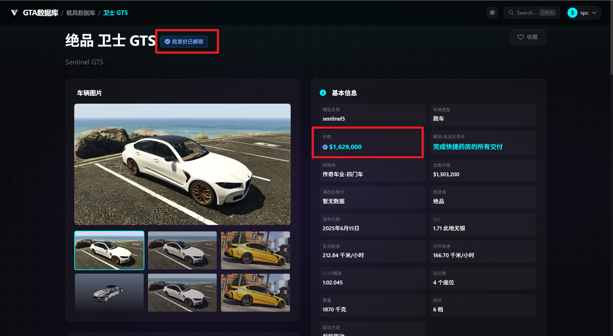

# 我的手机

可以在网站内模拟游戏内购买资产、车辆（会自动同步到我的车库）

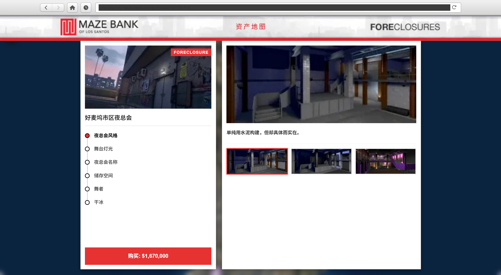

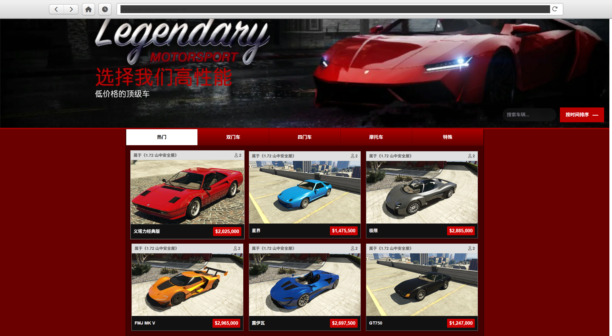

# 我的游戏

可以查询PS、Steam、Xbox平台的游戏进度

首先在头像下的个人信息-游戏信息内绑定平台账号

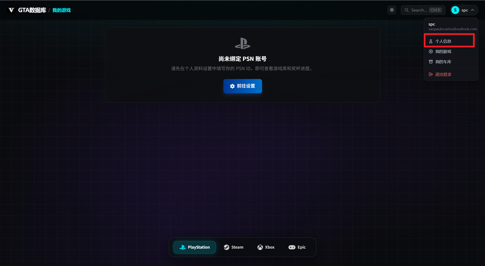

然后回到我的游戏界面刷新数据即可

# 每周更新

在每周更新内可以查看当周的更新内容，也可以在页面底部跳转到之前的更新（除了奖励都是根据tunables自动读取的）

点击上方的每日收藏品可以查看每日轮换内容（每日自动更新）

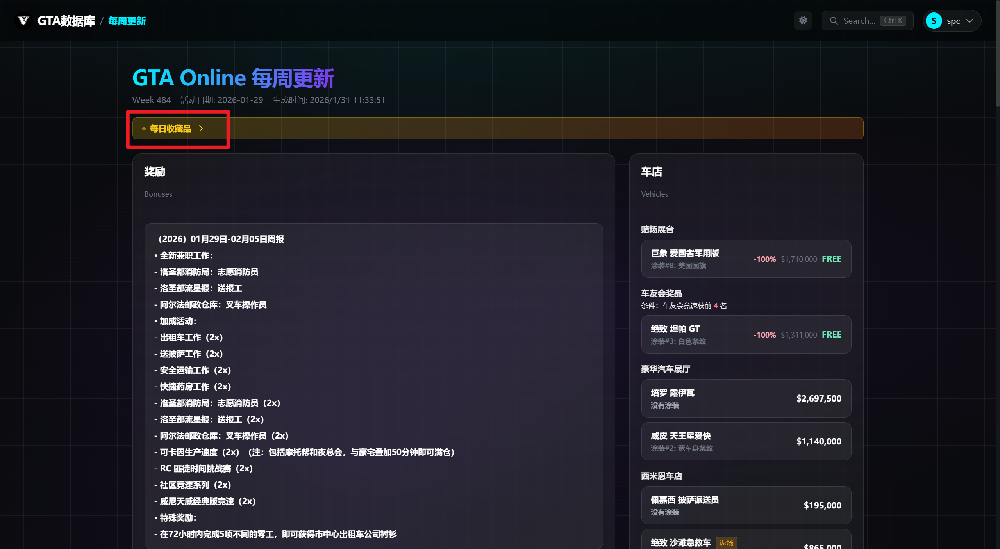

# 社交功能（聊天、论坛）

论坛里会发送一些攻略等，在社交组队里可以私聊、组队游戏等。~~（以后可能会关闭）~~

# 邮件订阅提醒

本站具有丰富的邮件提醒功能，在每周更新后可以实时发邮件提醒用户更新内容、返场车辆、武器等。

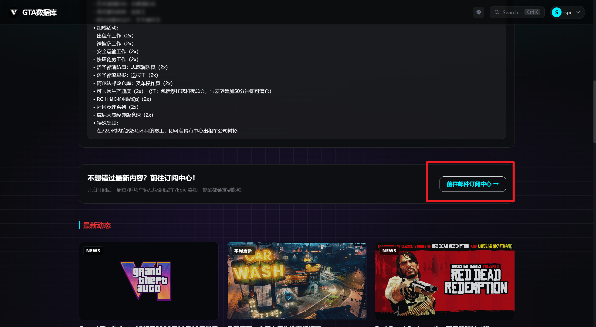

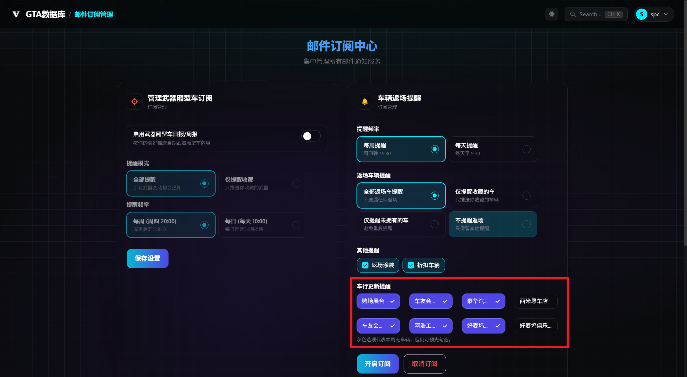

车行提醒需要勾选要提醒的车行

其他功能建议、反馈等

请通过网站底部联系我们提交反馈，感谢您的支持

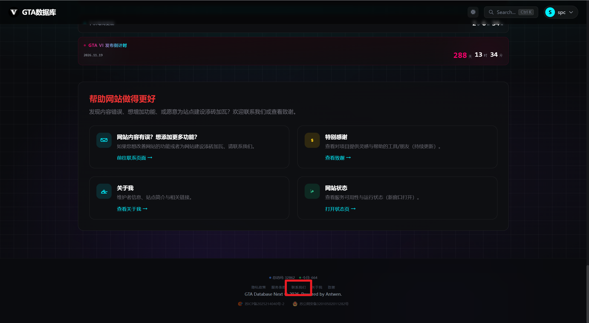
