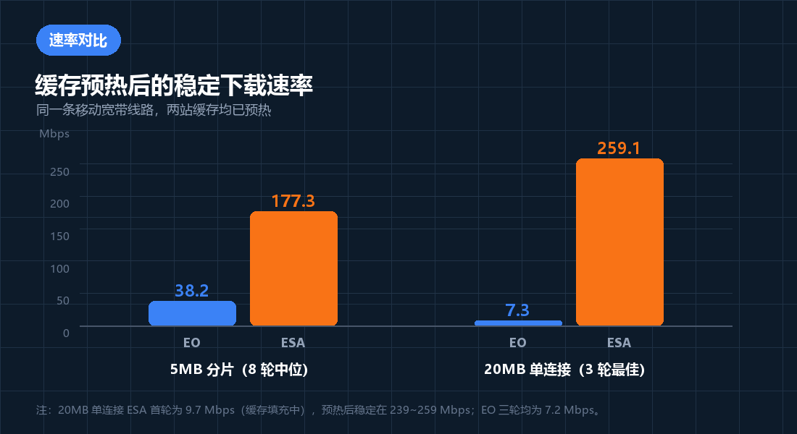
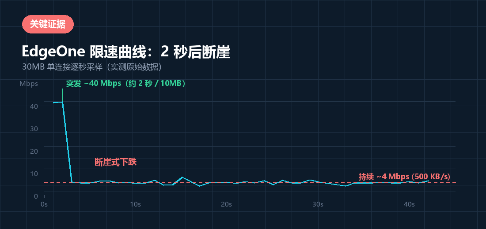
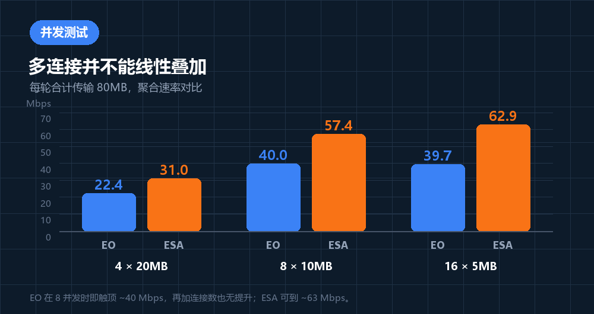

在上一篇《腾讯云 EdgeOne vs 阿里云 ESA：国内 CDN 访问性能与全链路实测对比》里，我们对比的是**动态站点**（Next.js SSR）在两家的表现，结论是 EdgeOne 更稳、更适合当主站。

但站点加速只占 CDN 用途的一半。站长的另一大需求是**分发静态大文件**——软件安装包、游戏资源、模型文件、视频素材。这类文件通常放在对象存储上（我们用 Cloudflare R2），再由 CDN 回源代理分发。

**大文件下载的性能模型和小文件完全不是一回事。** 小文件的瓶颈在握手和首字节，大文件的瓶颈在持续吞吐与限速策略。于是我们做了这轮针对性实测。

---

## 一、测试对象

同一个安装包，分别上传到两个 R2 存储桶，由两家 CDN 代理：

| | 代理方 | 测试链接 |
| :--- | :--- | :--- |
| **A** | 腾讯云 EdgeOne | `http://gta-db-team.antwen.cn/test/CommandCode-0.1.41-x64-setup.exe` |
| **B** | 阿里云 ESA | `https://gta-models.antwen.cn/test/CommandCode-0.1.41-x64-setup.exe` |

从 `Content-Range` 响应头可以读出这份文件的真实大小：

```http
Content-Range: bytes 0-5242879/145716483
```

即 **145,716,483 字节（139.0 MiB）**。两边的 `ETag` 完全一致，确认是同一份文件：

```text
ETag: "a9069887fe77d48fec498186889e8eee"
```

### 测试环境

- **线路**：江苏南京移动宽带，IPv4 `112.2.230.131`
- **本机下行天花板**：实测 **166 ~ 273 Mbps**（详见后文的对照实验）
- **工具**：Windows `curl`（HTTP/1.1）、.NET `HttpClient`（HTTP/2）、HTTP Range 分片、逐秒速率采样
- **方法**：冷热缓存分离测量 + ABBA 交错轮次（抵消时间偏差）

> **一个必须说明的局限**：所有数据来自**同一条移动宽带线路**。CDN 表现与运营商强相关，电信/联通用户的实际体验可能有差异。

---

## 二、核心结论速览



> **核心结论：对 R2 大文件分发，ESA 明显更快，EdgeOne 这个站点被硬限速了。**
>
> - **5MB 分片（8 轮交错中位）**：EdgeOne **38.2 Mbps** vs ESA **177.3 Mbps**，**ESA 快 4.6 倍**
> - **20MB 单连接**：EdgeOne 三轮都是 **7.2 Mbps**（耗时 22.10 / 22.06 / 22.12 秒）；ESA 预热后跑到 **239 ~ 259 Mbps**
> - **整包 139MB 单连接**：EdgeOne 需要 **276.5 秒（4.6 分钟）**；ESA 约 **5 秒**——差约 **50 倍**
>
> **EdgeOne 的问题**：单连接被限速。前约 2 秒（约 10MB）有 ~40 Mbps 突发，随后**断崖式跌到 ~4 Mbps（500 KB/s）**并稳定保持。
>
> **ESA 的问题**：**冷启动回源大文件会失败**（HTTP/2 流重置、响应截断、HTTP 522）。缓存预热后性能极佳，但首次访问容易踩坑。

---

## 三、冷启动：两家的第一印象完全不同

链接在此之前从未被访问过，所以第一次请求会**穿透缓存回源到 R2**。这是最珍贵的一次测量机会（缓存一旦预热就回不到冷态）。

| 指标 | EdgeOne | ESA |
| :--- | :--- | :--- |
| 首字节 TTFB | **6530 ms** | **1813 ms** |
| 结果 | 完成，但 139MB 用了 **276.5 秒**（4.0 Mbps） | **失败**：HTTP/2 流被重置 |
| 缓存状态 | `EO-Cache-Status: MISS` | `X-Site-Cache-Status: MISS` |

ESA 的失败信息很明确：

```text
The HTTP/2 server reset the stream.
HTTP/2 error code 'INTERNAL_ERROR' (0x2). (HttpProtocolError)
```

这一轮 EdgeOne 「赢了」——但赢的原因是它**至少传完了**，而不是它快。276 秒下完一个 139MB 的文件，平均只有 4 Mbps。

---

## 四、关键证据：EdgeOne 的「2 秒断崖」

为了搞清楚那 4 Mbps 从哪来，我们用 Range 请求做了一个 30MB 的连续下载，并**逐秒采样**：



原始采样数据（单位 Mbps）：

```text
1s:39.5  2s:39.9  3s:4.0   4s:3.9   5s:3.9   6s:4.6   7.1s:4.7  8.1s:3.9
9.1s:4.1 10.1s:3.7 11.1s:3.8 12.1s:5.0 13.1s:2.8 14.1s:3.0 15.1s:6.4
17s:2.4  18s:3.9  19s:4.1  20s:4.2  21s:3.6  22s:4.4  23s:3.9  24.1s:4.7
...
42.1s:4.7
```

**前两秒 39.5 → 39.9 Mbps，第三秒直接掉到 4.0 Mbps**，之后 40 秒一直贴着 4 Mbps 波动（2.4 ~ 6.8）。这不是网络抖动，是限速。

### 用实测数据反推限速模型

按「前 10MB 给 5 MB/s，之后 0.5 MB/s」建模，三种请求大小的预测与实测完全吻合：

| 请求大小 | 模型预测 | 实测 |
| :--- | :--- | :--- |
| 5 MB | 5 ÷ 5 = **1.0 s** | 1.05 s |
| 20 MB | 2 s + 10 ÷ 0.5 = **22 s** | 22.10 s |
| 139 MB | 2 s + 129 ÷ 0.5 = **260 s** | 276.5 s |

更能说明问题的是**复现精度**。20MB 单连接跑了三轮：

```text
第 1 轮: 22.10 s  (7.20 Mbps)
第 2 轮: 22.06 s  (7.30 Mbps)
第 3 轮: 22.12 s  (7.20 Mbps)
```

**三轮相差 0.06 秒，波动 0.3%。** 真实网络不可能有这么整齐的结果——这是令牌桶在起作用。

---

## 五、排除干扰：限速到底是谁造成的？

看到 4 Mbps 这种「太整」的数字，第一反应应该是怀疑自己的线路。我们做了三组对照：

| 对照实验 | 结果 |
| :--- | :--- |
| 同一 TCP 连接（keep-alive）连下 4 × 38MB = **146.9 MB** | **166 Mbps**，持续 7.1 秒 |
| 单次 36.7MB 单连接 | 151 Mbps / 179 Mbps |
| `mirrors.cloud.tencent.com`（**它自己也跑在 EdgeOne 上**） | 稳定 **166 ~ 273 Mbps** |

**三条结论：**

1. **我的线路不对长连接限速** —— 一条 TCP 连接持续 7 秒跑完 146.9MB，全程 166 Mbps。
2. **EdgeOne 平台本身不限速** —— 腾讯官方镜像同样由 EdgeOne 承载，响应头带着 `EO-Cache-Status: HIT`，能跑到 273 Mbps。
3. 所以那个 ~4 Mbps，是**这个站点（`gta-db-team.antwen.cn`）特有的限速**——大概率来自套餐档位自带的单连接/带宽限制，或站点上配置的「带宽封顶 / 限速」规则。

> **建议**：去 EdgeOne 控制台核对这个站点的套餐档位，以及规则引擎 / 流量管理里有没有限速相关配置。
>
> 顺带一提，`http://` 那个链接并非直出——实测返回 **301** 跳转到 HTTPS，说明站点的强制 HTTPS 是开启的。

---

## 六、ESA 的软肋：回源 R2 会失败

ESA 预热后快得惊人，但**首次拉取大对象时非常不可靠**：

| 场景 | 结果 |
| :--- | :--- |
| 首次冷启动 139MB | **HTTP/2 流重置**，失败 |
| 60–65MB 区段首访 | **响应提前中断**（`至少还差 1572864 字节`） |
| 120–125MB 区段首访 | **响应提前中断** |
| 20MB 单连接首访 | **HTTP 522**（回源连接超时） |
| 8 × 5MB（缓存填充期） | 只传了 25MB / 40MB，耗时 **339 秒**（0.6 Mbps） |

**17 分钟后复查，情况完全变了**：

```http
HTTP/1.1 206 Partial Content
Server: ESA
X-Site-Cache-Status: HIT
cf-cache-status: HIT
Age: 176
Content-Range: bytes 0-5242879/145716483
```

三个区段（开头 / 60MB / 120MB）全部 `HIT`、全部成功。**缓存填满之后，ESA 的速度优势才显现出来。**

### 为什么冷启动这么慢？回源绕到了美西

响应头里的 `CF-RAY` 暴露了回源落点：

```text
EdgeOne: CF-RAY: a4618cbf8ddfc236-SJC   ← 圣何塞（美国西海岸）
ESA    : CF-RAY: a461ae578b6d346b-SEA   ← 西雅图（美国西海岸）
```

**两家的回源请求都绕到了美国西海岸的 Cloudflare 节点。** 从国内边缘节点跨越太平洋去拉 R2，单程 RTT 就在 150ms 以上，大文件回源极易超时——这正是那些 522 和「响应提前中断」的根源。

---

## 七、并发测试：多连接并不能线性叠加

既然 EdgeOne 单连接被限速，那多开几条连接能不能绕过去？



每轮合计传输 80MB：

| 并发方式 | EdgeOne 聚合 | ESA 聚合 |
| :--- | :--- | :--- |
| 4 × 20MB | 22.4 Mbps | 31.0 Mbps |
| 8 × 10MB | 40.0 Mbps | 57.4 Mbps |
| 16 × 5MB | 39.7 Mbps | 62.9 Mbps |

**两个反直觉的结果：**

1. **EdgeOne 在 8 并发时就已经触顶 ~40 Mbps**，继续加到 16 并发完全没有提升。这说明限速**不是按连接独立计算**的，而是站点/客户端维度共享一个上限。想靠多线程下载器翻倍，行不通。
2. **ESA 也远达不到单连接的水平**：单个 5MB 能跑 177 Mbps，但 16 并发聚合只有 62.9 Mbps。并发场景下的瓶颈转移到了边缘节点回源一侧。

不过 EdgeOne 换成分片下载仍有实打实的收益——**28 次连续 5MB 覆盖整个 139MB**：

```text
成功 28/28 | 总耗时 30.3 秒 | 合计 139.0 MB | 聚合 36.7 Mbps | 最慢单片 1.42s
```

对比单连接的 276.5 秒，**快了约 9 倍**。原因是每个新请求都能重新拿到一次突发额度。

---

## 八、结论与落地建议

### 1. 大文件分发：优先走 ESA（但必须预热）

139MB 安装包的实际体验差距：

| 下载方式 | EdgeOne | ESA |
| :--- | :--- | :--- |
| 浏览器直接下载（单连接） | **约 4.6 分钟** | **约 5 秒** |
| 分片 / 多线程下载 | 约 30 秒 | 约 2 秒 |

差距达一到两个数量级。**如果这个 R2 存储桶是给用户下载资源用的，建议主用 ESA。**

### 2. 修掉 EdgeOne 的限速

同一个 EdgeOne 平台上，腾讯官方镜像能跑 273 Mbps，说明这个限制是可调整的。请检查：

- 站点套餐档位（免费版 / 个人版往往带单连接限速）
- **规则引擎 / 流量管理**里是否存在「带宽封顶」「限速」类规则
- 边缘响应相关的优化项是否误开了什么

### 3. 给 ESA 的大文件做预热

ESA 冷启动会踩 522 / 流重置，建议：

- **上线后自己先完整拉一遍**，把对象灌进边缘缓存，再对外公布链接
- 或者对重要大文件**多节点预热**（用不同省份的机器各拉一次）
- 同时检查回源配置：适当放宽**回源超时时间**、开启**源站长连接（Keep-Alive）**

### 4. 小文件维持现状

图片、JS、CSS 这类小文件（几 KB ~ 几百 KB）在两家的表现都很好，EdgeOne 的静态资源缓存命中与 Brotli 压缩都很正常。**这一部分不需要改。**

### 5. 更根本的思路：绕开「回源绕美西」

既然两家的回源都要跨太平洋去 Cloudflare，可以考虑：

- 把大文件同时放到**国内对象存储**（COS / OSS），让回源走内网
- 或者让用户**直连 R2 的 Cloudflare 原生域名**，避免中间多一跳

---

## 附录：复现方法

### Range 分片测单连接吞吐

```powershell
curl.exe -s -o NUL -A $UA --http1.1 `
  -H "Range: bytes=0-5242879" `
  -w "%{http_code}|%{time_total}|%{size_download}|%{speed_download}" $URL
```

### 逐秒采样（定位断崖位置）

用 .NET `HttpClient` 流式读取，每读满 1 秒记一次瞬时速率：

```powershell
$resp = $cli.SendAsync($req, [System.Net.Http.HttpCompletionOption]::ResponseHeadersRead).GetAwaiter().GetResult()
$st = $resp.Content.ReadAsStreamAsync().GetAwaiter().GetResult()
$buf = New-Object byte[] 262144
while (($k = $st.Read($buf, 0, $buf.Length)) -gt 0) {
    $n += $k
    $el = $sw.Elapsed.TotalSeconds
    if (($el - $lastT) -ge 1) {
        # 记录这一段（$el - $lastT）内传输的字节数换算成的 Mbps
    }
}
```

### 一个踩坑提醒

用 PowerShell 写测速脚本时，**变量名不区分大小写**。我们曾把局部数组命名为 `$curve`，而函数参数里有个 `[switch]$Curve`——两者是同一个变量，把数组赋给 switch 类型变量会直接抛：

```text
无法将类型"System.Object[]"的值转换为类型"System.Management.Automation.SwitchParameter"
```

排查了很久。写 PowerShell 测速脚本时，注意避开这类大小写碰撞。

---

## 后记

这轮实测最有价值的一点，其实是**方法本身**：

- 不要只用「整包下载」下结论——它会把**限速曲线**和**稳态吞吐**混成一个数字
- **Range 分片**能把一次长传输拆成多个短请求，从而区分「单连接限速」和「边缘分发能力」
- **逐秒采样**才能看清「突发 + 断崖」这类令牌桶行为
- 一定要做**对照实验**，否则很容易把自己线路的问题误判成 CDN 的问题

顺便说一句，上一篇的结论（主站用 EdgeOne）和这一篇的结论（大文件用 ESA）**并不矛盾**——它们是两种完全不同的负载：动态 SSR 拼的是稳定性和首字节，大文件分发拼的是持续吞吐。同一个账号下的不同站点，配置和套餐也可能不一样。

**选型要看负载，而不是看品牌。**
