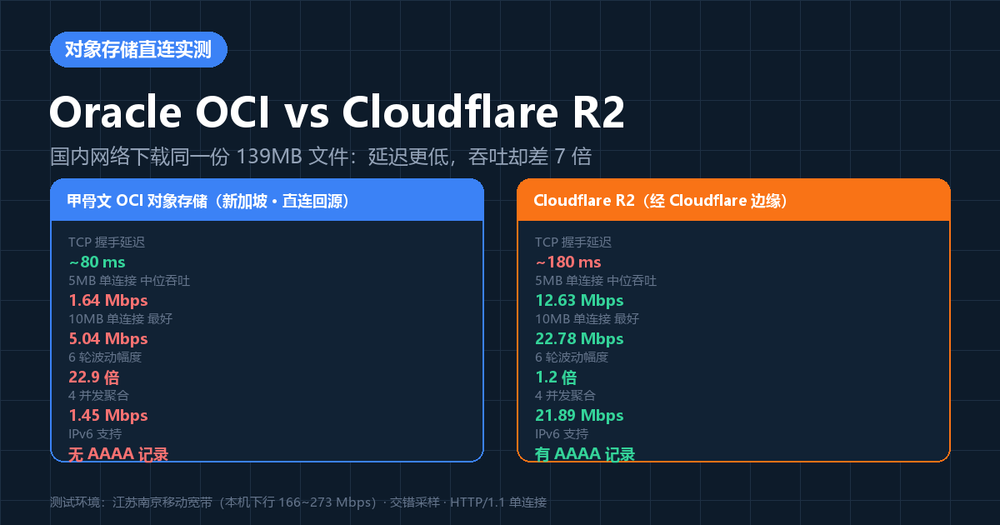
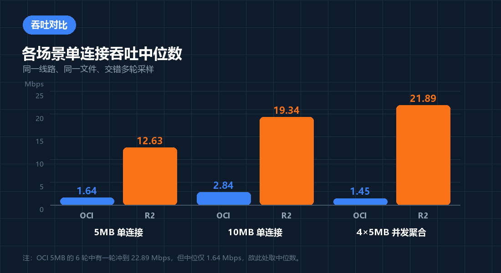
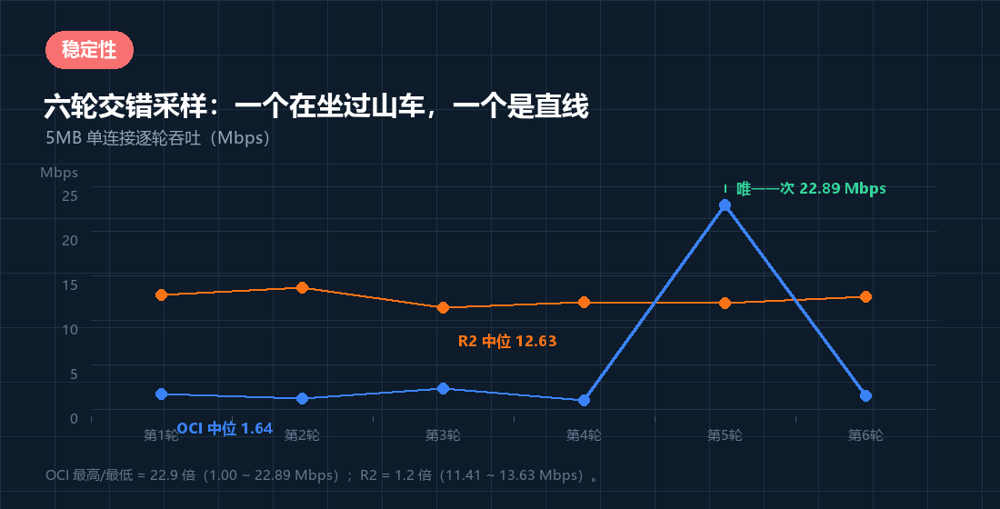
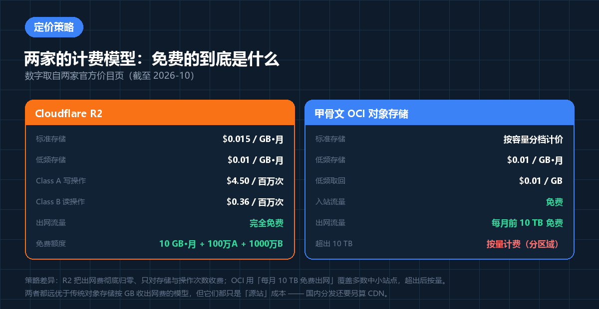

前面两篇文章我们测了 **EdgeOne vs ESA** 的站点加速性能，以及 **R2 经两家 CDN 代理后的大文件下载速度**。但那两篇测的都是「CDN 代理之后」的效果。

这一次把中间层拿掉，直接测**源站本身**：同一个文件放在两家海外对象存储上，从国内网络裸连下载，到底谁快、差多少、为什么。

结论比预想的更有意思：**延迟低的那家，吞吐反而差了 7 倍。**

---

## 一、测试对象与方法

### 测试对象

| | 存储服务 | 区域 | 访问方式 |
| :--- | :--- | :--- | :--- |
| **A** | 甲骨文 OCI 对象存储 | 亚太 · 新加坡区域 | 对象存储原生端点，直连回源 |
| **B** | Cloudflare R2 | 全球（Cloudflare 网络） | 绑定的自定义域名 |

两边放的是**同一份 139 MB（145,716,483 字节）的安装包**，通过 `Content-Range` 响应头确认了大小与同一性。

> **关于测试地址**：为保护存储桶，本文不公开这两个源站链接与账号标识，所有响应头中的域名与 IP 也已做脱敏。这不影响结论的可复现性——方法在文末完整给出。

### 测试环境

- **线路**：江苏南京移动宽带（IPv4 `112.2.230.x`）
- **本机下行天花板**：实测 **166 ~ 273 Mbps**——这个基准很重要，它排除了「是我自己线路慢」的可能
- **工具**：Windows `curl`（HTTP/1.1）、HTTP Range 分片
- **方法**：交错轮次（ABBA）抵消时间偏差；5 MB / 10 MB 两档分片；并发对照

### 一个必须先说清的公平性问题

**这两条链路并不完全对等。**

实测响应头显示，R2 那个自定义域名返回了：

```http
HTTP/1.1 206 Partial Content
Server: cloudflare
cf-cache-status: HIT
Age: 5896
CF-RAY: a4621cb67b3d2367-SEA
```

`cf-cache-status: HIT` + `Age: 5896` 说明——**这个对象已经被 Cloudflare 边缘缓存了**。也就是说，R2 这一侧拿到的其实已经是「对象存储 + Cloudflare CDN」的成绩，而甲骨文那一侧是**裸源站直连**。

这一点会在后文反复提醒：R2 赢的一部分原因是**架构**，而不只是存储本身。但从「一个真实用户点开链接能有多快」的角度看，这就是真实体验。

---

## 二、核心结论速览



> **结论：从国内直连，R2 比甲骨文 OCI 快约 7 倍，而且稳定得多。**
>
> - **吞吐**：5 MB 单连接中位，OCI **1.64 Mbps** vs R2 **12.63 Mbps**
> - **稳定性**：OCI 六轮波动 **22.9 倍**（1.00 ~ 22.89 Mbps）；R2 只有 **1.2 倍**（11.41 ~ 13.63 Mbps）
> - **并发**：4 连接并发，OCI 聚合 **1.45 Mbps**（比单连接还差），R2 聚合 **21.89 Mbps**
> - **反直觉的一点**：OCI 的 TCP 握手延迟只有 **~80 ms**，R2 是 **~180 ms**——**延迟低一倍的那家，吞吐差了 7 倍**

---

## 三、吞吐实测



| 场景 | 甲骨文 OCI | Cloudflare R2 | 差距 |
| :--- | ---: | ---: | ---: |
| 5 MB 单连接（中位） | 1.64 Mbps | 12.63 Mbps | **7.7×** |
| 10 MB 单连接（中位） | 2.84 Mbps | 19.34 Mbps | **6.8×** |
| 4 × 5 MB 并发聚合 | 1.45 Mbps | 21.89 Mbps | **15.1×** |

**推算整包 139 MB 的下载耗时**（按中位吞吐线性推算，仅作量级参考）：

| | 甲骨文 OCI | Cloudflare R2 |
| :--- | ---: | ---: |
| 按 5 MB 中位 | **约 11.8 分钟** | **约 1.5 分钟** |
| 按 10 MB 中位 | 约 6.8 分钟 | 约 1.0 分钟 |

单看 OCI 那 10 MB 的成绩（2.84 Mbps）就比 1 MB 时的 2.55 Mbps 好不了多少——**传输量翻了 10 倍，速率几乎没变**，这说明瓶颈不在 TCP 慢启动，而在链路本身的可用带宽。

---

## 四、稳定性：一个在坐过山车，一个是直线

如果只看平均值，会漏掉最有价值的信息。这是 5 MB 分片交错跑六轮的逐轮结果：



| 轮次 | 甲骨文 OCI | Cloudflare R2 |
| ---: | ---: | ---: |
| 第 1 轮 | 1.64 Mbps | 12.84 Mbps |
| 第 2 轮 | 1.17 Mbps | 13.63 Mbps |
| 第 3 轮 | 2.34 Mbps | 11.41 Mbps |
| 第 4 轮 | 1.00 Mbps | 11.95 Mbps |
| 第 5 轮 | **22.89 Mbps** | 11.84 Mbps |
| 第 6 轮 | 1.46 Mbps | 12.63 Mbps |
| **中位** | **1.64 Mbps** | **12.63 Mbps** |
| **波动** | **22.9 倍** | **1.2 倍** |

注意第 5 轮：OCI **也能跑到 22.89 Mbps**，甚至超过 R2 的每一轮。但其余五轮全在 1 ~ 2.4 Mbps 徘徊。

**这正是「海外直连」最典型的特征——它不是慢，而是不可预测。** 偶尔给你一条通畅的路径，大部分时候拥塞。对用户体验来说，「有时 3 秒有时 3 分钟」比「稳定 1 分钟」更糟。

R2 的曲线几乎是水平的：**11.41 ~ 13.63 Mbps**，六轮极差只有 2.2 Mbps。

---

## 五、关键洞察：延迟 ≠ 吞吐

这是本次测试最有价值的发现。

| 指标 | 甲骨文 OCI（新加坡） | Cloudflare R2（西雅图） |
| :--- | ---: | ---: |
| TCP 握手延迟 | **0.076 ~ 0.085 s** | 0.170 ~ 0.194 s |
| 5 MB 中位吞吐 | 1.64 Mbps | **12.63 Mbps** |
| DNS 记录 | 仅 A（无 IPv6） | A + AAAA |

甲骨文的新加坡端点从南京过去握手只要 **80 ms**，这是非常健康的跨区域延迟；R2 那条链路握手 **180 ms**，属于「绕了大半个太平洋」的水平。

**但吞吐完全反过来。**

原因在于两者的瓶颈根本不同：

- **延迟**由物理距离和路由跳数决定 → 新加坡近，所以 OCI 赢
- **吞吐**由可用带宽和丢包率决定 → 国际出口拥塞 + 丢包会让 TCP 拥塞窗口反复回退，所以 OCI 输

丢包的破坏力是超线性的：TCP 在丢包环境下会把拥塞窗口砍半再慢慢爬升（AIMD），一个 139 MB 的传输会经历成百上千次这样的循环，最终有效吞吐可能只有链路峰值的几分之一。**这也解释了那 22.9 倍的波动**——路况好时能跑满，路况差时几乎停摆。

顺带一个实用发现：**R2 走 IPv6 比 IPv4 更快**。

| R2 同一 10 MB 请求 | 速率 | TTFB |
| :--- | ---: | ---: |
| IPv4 | 14.95 / 18.42 Mbps | 0.91 / 1.01 s |
| **IPv6** | **21.21 / 22.78 Mbps** | **0.52 / 0.57 s** |

IPv6 下吞吐高约 **20%**、首字节快约一半。而**甲骨文这个端点没有 AAAA 记录**——纯 IPv6 客户端直接无法访问。

---

## 六、并发能不能救回来？

一个自然的想法：既然单连接被链路限制，那多开几条连接叠加不就行了？


| 4 × 5 MB 并发 | 甲骨文 OCI | Cloudflare R2 |
| :--- | ---: | ---: |
| 落盘校验 | 20.00 MB ✓ | 20.00 MB ✓ |
| 墙钟耗时 | **110.17 s** | **7.31 s** |
| 聚合吞吐 | **1.45 Mbps** | **21.89 Mbps** |
| 单条最慢耗时 | 110.49 s | 7.64 s |

**并发不但没救回 OCI，聚合吞吐（1.45 Mbps）反而比单连接中位（1.64 Mbps）还低。**

这说明 OCI 一侧的瓶颈是**共享的国际链路可用带宽**，而不是「单条 TCP 连接受限」。多条连接只是在同一条拥挤的管道里互相抢，还会因为更多连接数加剧丢包。

R2 一侧则从 12.63 Mbps 提升到 21.89 Mbps（+73%），说明它的边缘侧还有余量。

> 顺带一提，并发测试里的落盘校验（确认 4 个文件合计正好 20.00 MB）很有必要——早期版本脚本因参数传递问题多下了数据，如果不做落盘核对就会得出错误结论。

---

## 七、定价策略对比



以下是**从两家官方价目页直接核实**到的数据（截至 2026 年 10 月）：

### Cloudflare R2

| 项目 | 价格 |
| :--- | :--- |
| 标准存储 | $0.015 / GB·月 |
| 低频存储（Infrequent Access） | $0.01 / GB·月 |
| Class A 操作（写、列举） | $4.50 / 百万次 |
| Class B 操作（读） | $0.36 / 百万次 |
| **出网流量（Egress）** | **完全免费** |
| 免费额度 | 10 GB·月 存储 + 100 万次 Class A + 1000 万次 Class B |

### 甲骨文 OCI 对象存储

| 项目 | 价格 |
| :--- | :--- |
| 标准存储 | 按容量分档计价 |
| 低频存储（Infrequent Access） | $0.01 / GB·月 |
| 低频取回（Retrieval） | $0.01 / GB |
| **入站流量** | **免费** |
| **出网流量** | **每月前 10 TB 免费**（按来源区域划分三档） |
| 超出 10 TB 部分 | 按量计费 |

> 说明：甲骨文标准档的单价采用**按容量分档的动态计价**（官方页面按数据量区间渲染不同单价），本文只写入能从官方页面直接核实到的数据，具体单价请以官网价目页为准。

### 两家策略的本质差异

| 维度 | Cloudflare R2 | 甲骨文 OCI |
| :--- | :--- | :--- |
| **免费的是什么** | 出网流量（无上限） | 出网流量（每月 10 TB 上限） |
| **收的是什么** | 存储 + 操作次数 | 存储 + 超出额度后的流量 |
| **定价思路** | 把出网费归零，靠存储和操作数变现 | 用大额免费出网额度获客，超出后按量 |
| **适合谁** | 高流量分发、CDN 回源源站 | 中小规模、流量可预测的业务 |

**关键结论：两家都比传统对象存储厚道得多。**

传统云厂商（AWS S3 等）的经典模型是「存储便宜、**出网贵**」——出网费常常是账单的大头，也是厂商锁定用户的手段。R2 直接把这一项归零，OCI 则给到每月 10 TB 的免费额度，本质上都是**用出网费作为获客武器**。

但要注意一个陷阱：**这两家算的都只是「源站成本」。** 如果你的用户在国内，源站的出网费省下来了，但真正决定体验的 **CDN 流量费**还没开始算。

---

## 八、深入分析：国内文件分发到底该怎么做

把这次的数据和前面两篇的结论拼起来，国内文件分发的全貌就清晰了。

### 文件分发的三个层次

```text
┌─────────────────────────────────────────────────┐
│  第三层：成本                                     │
│  源站出网费 + CDN 流量费                          │
├─────────────────────────────────────────────────┤
│  第二层：加速（决定终端用户体验）                  │
│  国内 CDN 边缘缓存：实测可达 177 ~ 259 Mbps       │
├─────────────────────────────────────────────────┤
│  第一层：源站（决定回源可靠性）                    │
│  海外对象存储：实测国内直连仅 1.6 ~ 12.6 Mbps      │
└─────────────────────────────────────────────────┘
```

### 三层各自的实测结论

**第一层 · 源站**：海外对象存储从国内**直连**都很慢。本次实测 OCI 中位 1.64 Mbps、R2 中位 12.63 Mbps，而我的线路能跑到 273 Mbps。**这意味着源站直连只能用掉本机带宽的 0.6% ~ 4.6%。**

**第二层 · 加速**：一旦在前面挂上国内 CDN，速度提升是数量级的。上一篇实测中，同一个 R2 对象经阿里云 ESA 代理后，5 MB 分片能跑到 **177.3 Mbps**——比本次 R2 直连的 12.63 Mbps 快了 **14 倍**，比 OCI 直连快了 **108 倍**。

**第三层 · 成本**：这里有个容易被忽略的坑——**CDN 回源也要走国际链路**。上一篇实测发现，EdgeOne 与 ESA 回源 R2 时都绕到了**美国西海岸**（圣何塞 / 西雅图），这正是冷启动时出现 `522` 与响应截断的根源。

### 三条实践建议

**1. 国内用户为主的分发，不要让终端直连海外存储**

这是本次实测最直接的结论。139 MB 的文件，直连 OCI 要十几分钟，直连 R2 要一分半；挂上国内 CDN 后可以压到十几秒。**这不是优化，这是可用与不可用的区别。**

**2. 源站选型看「回源友好度」，而不是只看终端速度**

既然终端不直连源站，源站的价值就体现在**回源时**：

- **出网费**：R2 完全免费，OCI 每月 10 TB 免费——都把这一项做得很好
- **回源成功率**：这一点 OCI 反而可能更稳（新加坡回源延迟低、且是原生端点无中间缓存层）
- **缓存友好度**：R2 经 Cloudflare 有天然边缘缓存，本地缓存命中率高

**3. 如果规模上来了，考虑国内对象存储 + 国内 CDN**

海外存储再便宜，回源始终要跨国际链路。当流量足够大时，把热文件放到国内对象存储（COS / OSS），让 CDN 走内网回源，可以同时改善**回源延迟、回源成功率和回源成本**这三项。海外存储则退居「冷备 / 归档」角色。

### 一个成本模型示例

假设一个 139 MB 的安装包，每月被下载 10,000 次（约 1.36 TB 出网流量）：

| 方案 | 源站出网费 | 说明 |
| :--- | :--- | :--- |
| R2 直连 | **$0** | 出网免费，但用户体验差（约 1.5 分钟/次） |
| OCI 直连 | **$0** | 10 TB 免费额度内，但体验更差（约 12 分钟/次） |
| R2 + 国内 CDN | **$0 出网** + CDN 流量费 | 体验最好（十几秒），成本主要在 CDN |

**注意这张表的重点：在 10 TB 以内，两家的出网费都是零。** 所以真正拉开成本差距的不是对象存储，而是你选了哪家 CDN、以及 CDN 的流量单价。

**换句话说：对象存储选谁，影响的是回源可靠性；CDN 选谁，影响的才是钱和体验。**

---

## 九、结论

1. **从国内直连，Cloudflare R2 比甲骨文 OCI 快约 7 倍**（12.63 vs 1.64 Mbps），且稳定性高一个数量级（波动 1.2 倍 vs 22.9 倍）。

2. **延迟低不等于吞吐高。** OCI 新加坡握手 80 ms、R2 西雅图 180 ms，但 OCI 吞吐只有 R2 的 1/7。瓶颈在国际链路的**带宽与丢包**，不在距离。

3. **并发救不了拥塞链路。** OCI 4 并发聚合 1.45 Mbps，反而低于单连接中位；R2 则从 12.63 提升到 21.89 Mbps。

4. **注意公平性**：R2 那一侧实际走的是 Cloudflare 边缘缓存（`cf-cache-status: HIT`），成绩里包含了 CDN 的功劳；OCI 是裸源站。这既是本次对比的局限，也恰好说明了架构的价值。

5. **定价上两家都很好，但逻辑不同**：R2 把出网费彻底归零；OCI 给每月 10 TB 免费出网额度。10 TB 以内两家出网成本都是零，真正的成本变量在 CDN。

6. **国内文件分发的正确姿势**：海外对象存储当源站 + 国内 CDN 做加速 + 热文件预热。**不要让国内用户直连海外存储**——那是 7 到 100 倍的体验差距。

---

## 附录：复现方法

### 1. 基础吞吐（Range 分片 + 交错轮次）

```powershell
curl.exe -s -o NUL -A $UA -H "Range: bytes=0-5242879" `
  -w "%{http_code}|%{time_starttransfer}|%{time_total}|%{size_download}" $URL
```

`%{time_starttransfer}` 是首字节时间（TTFB），`%{size_download}` 用来验证是否真的拿到了请求的分片大小。

### 2. IPv4 / IPv6 对比

给 curl 加 `-4` 或 `-6` 即可。本次实测中 R2 的 IPv6 比 IPv4 快约 20%，而 OCI 没有 AAAA 记录。

### 3. 并发测试务必做落盘校验

这是本次踩过的一个真实的坑：早期版本的并发脚本因为参数传递问题，每次请求实际下载的数据量大于请求的 Range，如果只看 curl 自己报告的 `size_download` 就会得出错误结论。

**正确做法**：让每个并发任务写入独立的临时文件，最后按**文件实际大小**求和并断言。

```powershell
# 断言落盘总量等于预期，否则结论不可信
$tot = 0
Get-ChildItem $tmp -Filter "$name-*.bin" | ForEach-Object { $tot += $_.Length }
if ($tot -ne 4 * $LEN) { throw "落盘校验失败：实际 $tot 字节" }
```

### 4. 结果解读的三条原则

- **必须做对照**：先测本机天花板（本次 166 ~ 273 Mbps），否则无法区分「对方慢」和「我这条线路慢」
- **必须看波动**：中位数会掩盖问题。OCI 六轮里有一轮 22.89 Mbps，只看最好成绩会得出完全相反的结论
- **必须交错采样**：同一时刻交替测两家，用 ABBA 顺序抵消时段偏差
